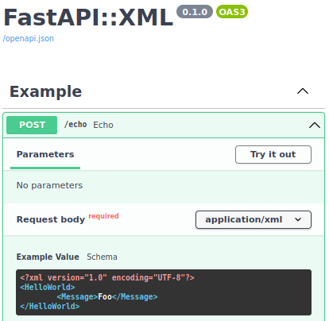

<h1 align="center">FastAPI::XML</h1>
<p align="center">
    
    <a href="https://app.codecov.io/gh/cercide/fastapi-xml"></a>
    
    
    <a href="https://www.codefactor.io/repository/github/cercide/fastapi-xml"></a>
    
    <br>
    <code>pip install fastapi-xml</code><br>
</p>

A bridge between [FastAPI](https://github.com/tiangolo/fastapi) and [xsdata](https://github.com/tefra/xsdata). Together,
fastapi handles xml data structures using dataclasses generated by xsdata. Whilst, fastapi handles the api calls, xsdata
covers xml serialisation and deserialization. In addition, openapi support works as well.

<p align="center"></p>

```python
from dataclasses import dataclass, field
from fastapi import FastAPI
from fastapi_xml import add_openapi_extension
from fastapi_xml import NonJsonRoute
from fastapi_xml import XmlAppResponse
from fastapi_xml import XmlBody

@dataclass
class HelloWorld:
    message: str = field(metadata={"example": "Foo","name": "Message", "type": "Element"})

app = FastAPI(title="FastAPI::XML", default_response_class=XmlAppResponse)
app.router.route_class = NonJsonRoute
add_openapi_extension(app)

@app.post("/echo", response_model=HelloWorld, tags=["Example"])
def echo(x: HelloWorld = XmlBody()) -> HelloWorld:
    x.message += " For ever!"
    return x

if __name__ == "__main__":
    import uvicorn
    uvicorn.run(app, host="127.0.0.1", port=8000)
```
